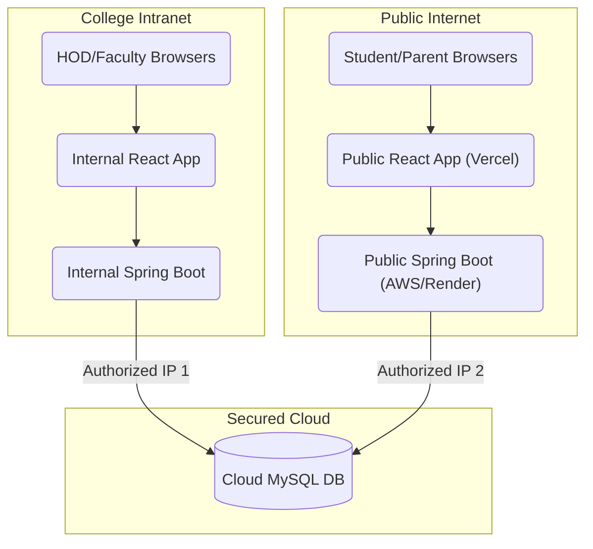

# Network Access Restriction Plan

To restrict the Principal, HOD, and Faculty dashboards exclusively to the college network while allowing Students and Parents to access the Student dashboard across the internet, the recommended strategy is Option 3: Split Deployment.

## Split Deployment (Option 3) with MySQL Database

Since you want to use the **Split Deployment** option, we need to physically (or logically) isolate your applications while ensuring both the college-internal systems and the public internet systems securely share the same MySQL database.

Here is the exact architectural plan to achieve this.

### 1. The Database Architecture (MySQL)
Your database is the central source of truth. Both the internal (college) backend and external (student) backend must connect to it.

> **Important**: **Host the Database on a Managed Cloud Provider (e.g., AWS RDS, DigitalOcean, or Aiven)**
> Do not host the database solely on the college LAN unless you have a static IP and an enterprise firewall configured to allow incoming connections *only* from your public Student backend server. A cloud database is significantly easier to secure.

**Security Configuration for MySQL:**
- **IP Allowlisting:** Configure the MySQL server firewall to allow incoming connections from **exactly two places**:
  1. The static public IP address of the college (where the internal backend lives).
  2. The static public IP address of the server hosting the external (Student) backend.
- Any other IP (like a student's home internet) attempting to ping the database directly will be blocked at the network level.

---

### 2. The Internal Stack (College Network Only)
This stack handles the sensitive administrative work. It completely blocks the public internet from reaching it.

- **Frontend (React - Principal/HOD/Faculty):**
  - Host this on a local college server (e.g., IIS or Apache on a campus machine).
  - Alternatively, host it on Vercel/Netlify but configure Edge Functions to block any request not coming from the college's IP address.
- **Backend (Spring Boot - Admin/Faculty APIs):**
  - Host this on a server sitting physically inside the college network.
  - This Spring application connects directly to the Cloud MySQL database.
  - Because it exists entirely on the intranet, students at home cannot possibly reach the URLs (e.g., `http://192.168.1.50:8080/api/faculty/marks`).

---

### 3. The External Stack (Public Internet)
This stack only handles student functionality and is safe for parents and students to access globally.

- **Frontend (React - Student Dashboard):**
  - Host this publicly on Vercel, Netlify, or AWS Amplify.
  - This application talks *only* to the External Backend.
- **Backend (Spring Boot - Student APIs Only):**
  - Host this publicly on a cloud server (AWS EC2, Render, Heroku).
  - **Crucial Step:** Create a separate Spring Boot application (or a separate Maven profile) that *only* runs controllers for the Student paths (e.g., `StudentController.java`, `AuthController.java` limited to Student roles).
  - Do NOT include the `PrincipalController`, `HODController`, or `FacultyController` in this deployed instance.
  - This application connects to the same central Cloud MySQL database.

## Architecture Diagram (Mental Model)

## Implementation Steps (For Later)

1. **Database Migration:** If your MySQL is currently running locally on your PC (e.g., `localhost:3306`), migrate it to a cloud provider so both endpoints can reach it.
2. **Backend Splitting:**
   - Instead of running one massive Spring Boot JAR, we will set up Spring Profiles (e.g., `application-internal.properties` vs `application-external.properties`).
   - The "external" profile will explicitly disable all the Admin and Faculty REST Controllers.
3. **Deployment:**
   - Deploy the public Spring Boot (using the external profile) and the public React Student app to cloud providers.
   - Run the internal Spring Boot and internal React apps on the college's local servers.
